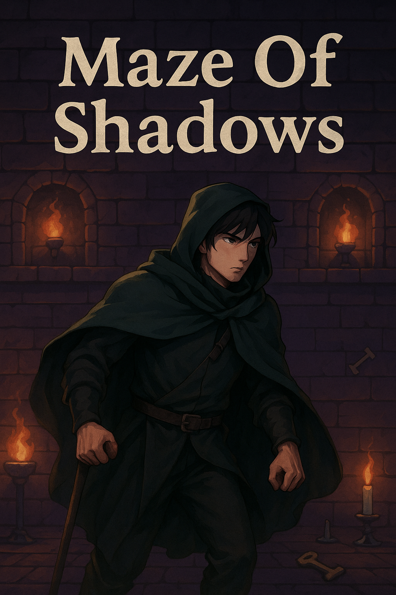

# CS 4398 Group 6 Final Project: Maze of Shadows

**Course:** CS 4398 – Software Engineering Project (Spring 2025)
**Instructor:** Shibbir Ahmed
**Team (Group 6):**
*   Logan Falkenberg
*   Farrah Omar
*   Brad Hayes
*   Collin Reisman
**Release Date:** May 2nd, 2025

---

### A Note From the Developers

This project, "Maze of Shadows," was brought to life in **under two months (March - May 2025)** as our final capstone for the Software Engineering Project course. For all of us, this was our **first foray into game development with the Unity Engine**. We embraced an **Agile development process**, utilizing Trello for task management and sprint planning, and adhered to industry-standard software engineering principles, including structured Git branch management and consistent team communication.

While "Maze of Shadows" is a **work in progress** with many potential avenues for future development, we are incredibly proud of the complexity and functionality we were able to achieve in such a short timeframe, especially given our learning curve with Unity. This project represents a significant learning experience and a testament to our collaborative efforts.

---

## ✨ Watch the Maze of Shadows in Action! ✨

Curious to see how it all comes together? Check out our gameplay demo video!

**Click the thumbnail below and download the raw video to see it in action!**
[](demo-video.mp4)

*The video demonstrates:*
*   Board size selection and the interactive Build Phase.
*   Seamless transition to the Play Phase.
*   Player character spawning and navigation.
*   Dynamic camera work and enemy encounters.
*   Combat mechanics and coin collection.

---

## Table of Contents

1.  [Overview](#1-overview)
2.  [Key Features](#2-key-features)
3.  [Technologies Used](#3-technologies-used)
4.  [Project Structure](#4-project-structure)
5.  [Setup and Running the Project](#5-setup-and-running-the-project)
    *   [From Unity Editor](#from-unity-editor)
    *   [Using Pre-built Executable](#using-pre-built-executable)
6.  [Gameplay](#6-gameplay)
7.  [Testing](#7-testing)

---

## 1. Overview

**Maze of Shadows** is the final capstone project for CS 4398 - Software Engineering Project by Group 6. It is a Unity-based puzzle-adventure game featuring a unique two-phase system:

*   **Build Phase:** Players strategically construct a maze by sliding tiles, akin to a slider puzzle. The layout directly impacts the subsequent gameplay.
*   **Play Phase:** The abstract tiles from the build phase expand into fully explorable 3D rooms. Players navigate their chosen character through this dynamically generated maze, encountering enemies, collecting items, and aiming to achieve the win condition.

The project emphasizes modular design, dynamic content generation, and interactive gameplay elements, developed iteratively over three sprints.

---

## 2. Key Features

*   **Dynamic Maze Construction:**
    *   Players slide tiles on a grid (configurable sizes: 3x3, 4x4, 5x5) to create a unique maze layout.
    *   The `BoardManager` script handles tile movement logic, adjacency checks, and ensures valid maze configurations.
*   **Seamless Phase Transition:**
    *   Build-phase tiles (2D representations) map 1:1 to larger, pre-designed 3D room prefabs in the play phase.
    *   `PlaySceneManager` instantiates rooms based on the build phase layout, including a dedicated spawn room.
*   **Interactive Player Characters:**
    *   Multiple playable characters, each with unique sprites and animations.
    *   Player controls include movement, melee attacks, and projectile-based ranged attacks.
    *   Characters have a health system and death animations.
*   **Challenging Enemies:**
    *   Enemies (e.g., Samurai) spawn randomly within rooms upon player entry.
    *   AI includes player-following behavior and projectile attacks.
    *   Enemies have health, animations (walk, shoot, die), and can be defeated by the player.
*   **Dynamic Camera System:**
    *   Each room in the play phase is associated with its own dedicated camera.
    *   The active camera switches based on player location (room entry/exit).
    *   Cameras are conceptually linked to maze tiles and shift position if the corresponding tile is moved in the build phase (implemented as per-room cameras activated on entry).
*   **GUI and Game Management:**
    *   Themed UI for start screen, build phase controls, play phase HUD, and pause/exit menus.
    *   Functionality to start, pause, resume, and exit the game.
*   **Objective-Based Gameplay:**
    *   Players must collect a target number of coins, which scales with the maze size (Board Size + 2).
    *   Coins spawn randomly (0, 1, or 2 per room).
*   **Boundary Enforcement:**
    *   Special border room prefabs are generated around the maze perimeter to prevent players from walking out of bounds.

---

## 3. Technologies Used

*   **Game Engine:** Unity 2022.3 LTS
*   **Programming Language:** C#
*   **UI Toolkit:** Unity UI
*   **Testing Frameworks:**
    *   Unity Test Framework
    *   NUnit
*   **IDE & Development Tools:**
    *   Unity Editor
    *   Visual Studio 2022
*   **Version Control:** Git & GitHub
*   **Project Management:** Trello
*   **Design & UML Tools (for planning):**
    *   PlantUML
    *   Google Docs

---

## 4. Project Structure

Key directories and files within the repository:

*   `Assets/Scripts/`: Contains all C# scripts for game logic (e.g., `BoardManager.cs`, `PlaySceneManager.cs`, `PlayerController.cs`, `EnemyAI.cs`, `CameraTrigger.cs`).
*   `Assets/Scenes/`: Unity scenes for different game states (e.g., StartMenu, BuildPhase, PlayPhase).
*   `Assets/Prefabs/`: Reusable game objects such as room tiles, characters, enemies, UI elements, and projectiles.
*   `EXE/`: Contains the pre-built executable version of the game for direct play.
*   `Demo Video.mp4`: The video demonstration of the game's features and gameplay (if included directly in the repo).

---

## 5. Setup and Running the Project

### From Unity Editor

1.  **Clone the repository:**
    ```bash
    git clone <repository-url>
    ```
2.  **Open in Unity Hub:**
    *   Add the cloned project folder to Unity Hub.
    *   Ensure you have **Unity Editor version 2022.3.x LTS** (specifically 2022.3 LTS as mentioned) installed.
3.  **Open the Project:**
    *   Launch the project from Unity Hub.
4.  **Load Start Scene:**
    *   In the Unity Editor, navigate to `Assets/Scenes/` in the Project window.
    *   Open the main start scene (e.g., `StartScene` or equivalent).
5.  **Run:**
    *   Press the Play button in the Unity Editor.

### Using Pre-built Executable

1.  Navigate to the `/EXE/` folder in the repository.
2.  Run the game executable (e.g., `MazeOfShadows.exe` for Windows).

---

## 6. Gameplay

1.  **Start Screen:**
    *   The game begins with a start screen where the player can select the desired maze size (e.g., 3x3, 4x4, 5x5).
2.  **Build Phase:**
    *   Players are presented with a grid of slidable tiles and one empty space.
    *   Click on a tile adjacent to the empty space to slide it, arranging the maze to their strategic advantage.
    *   Once satisfied with the layout, click the "Play" button to proceed.
3.  **Play Phase:**
    *   The player character spawns in a designated start room (corresponding to the empty tile in the build phase).
    *   Navigate the maze using standard controls (typically WASD/Arrow Keys for movement, mouse/keys for attacks).
    *   The camera dynamically switches to focus on the current room the player is in.
4.  **Objective & Challenges:**
    *   Collect the required number of coins (Board Size + 2) scattered throughout the rooms.
    *   Encounter and combat enemies that spawn in rooms. Enemies can damage the player.
    *   Player characters can attack enemies using melee or ranged abilities.
5.  **Winning/Losing:**
    *   The game is won by collecting all required coins.
    *   The game can be lost if the player's health reaches zero.
6.  **Pause Menu:**
    *   Players can typically press `Escape` to access a pause menu, allowing them to resume, or exit the game.

---

## 7. Testing

Unit tests were implemented using the **Unity Test Framework** and **NUnit** to ensure the reliability of core game mechanics.

*   **Frameworks Used:** Unity Test Framework, NUnit
*   **Key Modules Tested:**
    *   `BoardManager.cs` (tile adjacency, valid moves, board setup for various sizes)
    *   `PlaySceneManager.cs` (room mapping, prefab instantiation)
    *   `CoinTotalSpawnBMTests.cs` (coin spawning logic)
    *   Camera triggering logic
*   **Note:** While detailed test cases are not listed here, they formed an integral part of the development process to ensure system stability.
